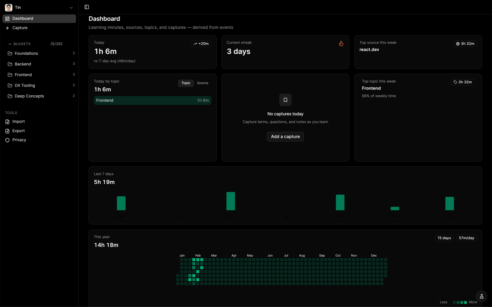

# Append

WakaTime for learning — a privacy-first telemetry dashboard that tracks where your learning time goes.

[append.tindev.dev](https://append.tindev.dev)

---

## Overview

- **Automatic time tracking** via Chrome extension (heartbeat-based telemetry)
- **Visual dashboards** — Today, Week, and Heatmap views with streaks
- **Topic categorization** — Backend, Frontend, DX Tooling, Deep Concepts, Foundations
- **Privacy-first** — URL hashing client-side, optional hints only, no page content collected
- **User-owned data** — full export in NDJSON format, self-serve account deletion
- **AI suggestions** — term suggestions with per-user quotas and global budget controls



---

## Stack

**Frontend** — React 19, TanStack Router, TanStack Query, TanStack Form, Tailwind CSS, shadcn/ui, Vite

**Backend** — Hono on Cloudflare Workers, Drizzle ORM, D1, R2, Valibot

**Extension** — Chrome MV3, Vite

**Auth** — better-auth

**AI** — Vercel AI SDK, Cloudflare AI Gateway, OpenAI

**Testing** — Vitest, Playwright, @cloudflare/vitest-pool-workers

**Infrastructure** — Cloudflare Pages + Workers, Wrangler, Doppler, Just

**Code Quality** — TypeScript, Biome, ESLint, eslint-plugin-boundaries

**Runtime** — Node.js 24.13+ (Volta), pnpm

## Architecture

Chrome extension emits `artifact_active` heartbeats during active learning. The API ingests events idempotently into an append-only store. Server derives sessions and daily rollups on-read. Dashboard renders views from rollups.

Key decisions:

- Events are append-only — corrections are new events, not rewrites
- Privacy-first defaults — URL hashing, minimal data collection
- Dashboard-first UX — if it doesn't improve Today/Week/Heatmap, it's not MVP
- Public auth with kill switches — configurable modes and safety gates

---

## Quick Start

```bash
just setup  # First-time setup: deps, secrets, migrations
just dev    # Start development servers
just help   # Show all available commands
```

For CI or environments with secrets already configured:

```bash
pnpm setup:deps      # Install deps + run migrations (no secrets sync)
pnpm dev:nosecrets   # Start servers without Doppler wrapper
```

## Documentation

- [docs/design.md](docs/design.md) — product vision, architecture, domain glossary, event taxonomy
- [docs/adr/](docs/adr/) — 19 active architectural decision records on auth, telemetry, AI quotas, data retention, UI patterns, and more
- [docs/runbook.md](docs/runbook.md) — setup, secrets management, operations

---

## Development

### Deployment

```bash
pnpm deploy:api   # Deploy API to Cloudflare Workers
pnpm deploy:web   # Deploy Web to Cloudflare Pages
pnpm deploy       # Deploy both
```

Secrets managed via Doppler (canonical) and synced to Cloudflare.

### Testing

```bash
pnpm test          # Run all tests
pnpm test:api      # Run API tests
pnpm test:watch    # Watch mode
pnpm ci            # Full CI (lint + typecheck + test + boundaries)
```

Unit tests (Vitest), integration tests (Vitest + Cloudflare Workers pool), extension tests (Vitest), E2E tests (Playwright).

### Code Quality

```bash
pnpm check             # Biome format + lint
pnpm typecheck         # TypeScript check
pnpm lint:boundaries   # Module boundary checks
```

Pre-commit hooks enforce formatting, linting, boundary checks, and docs policy. Full CI on pre-push.

---

## License

MIT © 2025 tindotdev — see [LICENSE](LICENSE).
